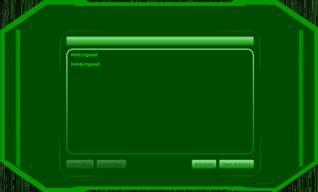
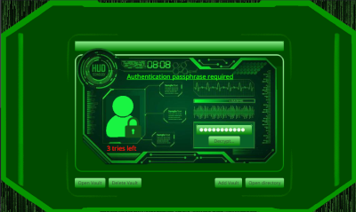
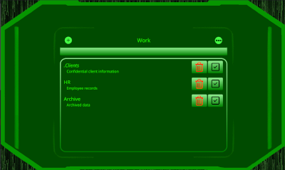
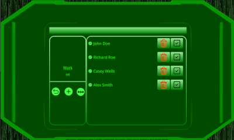
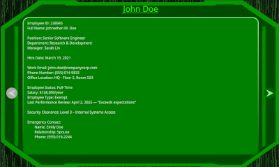
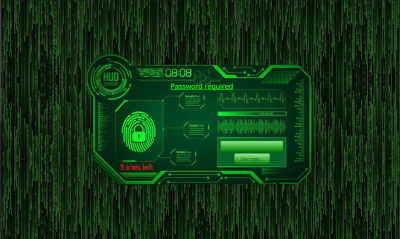

# Mangrypt

> [!IMPORTANT] 
> **Mangrypt currently is under active development and neither stable nor completed (yet). Features may change and bugs may occur. Use with caution!**

**Mangrypt** is a user-friendly encryption application designed to protect sensitive user data. It supports encryption for text, images, audio, and video, storing data in individually encrypted `.mgvault` files for easy management.

---

## Download & Installation

_[Coming soon]_

---

## Application UI

> ![IMPORTANT]
> These images are outdated

The following references illustrate the application UI's appearance:

| Vault File Overview                       | Accessing a Vault                                |
|-------------------------------------------|--------------------------------------------------|
|  |  |

| Folder Overview                            | Folder content                                      |
|--------------------------------------------|-----------------------------------------------------|
|  |  |

| Text-Data View                               | Obscuring Sensitive Data                        |
|----------------------------------------------|-------------------------------------------------|
|  |  |

> UI elements shown may change in future versions and may not exactly match these screenshots.

---

## Encryption Architecture

### How Vault Encryption Works

Mangrypt uses a layered and secure encryption model built on modern cryptographic standards to encrypt the `.mgvault` files on your disk:

1. **Master Key Derivation**  
   Two passwords are securely combined, and concatenated. This combined secret is then used with **Argon2id** to derive a 256-bit master key.

    Mangrypt uses two separate passwords and the Argon2id algorithm (winner of the Password Hashing Competition) to securely derive your master key. Argon2id is widely regarded as one of the safest password hashing algorithms available today.

2. **Per-Encryption Key Derivation**  
   For each encryption operation, a random per-encryption salt is generated. This salt, together with the master key, is processed through **HKDF** (HMAC-based Key Derivation Function) to create a unique encryption key.

   > Every time you encrypt data, Mangrypt generates a fresh key — even if you're encrypting the same data with the same passwords. This prevents patterns from forming and increases security.

3. **Encryption Algorithm**  
   AES in GCM mode (128-bit key) is used for authenticated encryption, providing both confidentiality and integrity. Each encryption operation uses a new random IV (12 bytes).

   > AES-128-GCM encrypts your data while ensuring any tampering is detected through an authentication tag that verifies data integrity. AES is a widely used encryption standard, adopted by governments and organizations worldwide for its strong security.

4. **Data Format**  
   Encrypted data is structured as:  
   `version (4B) | masterSalt (16B) | perEncryptSalt (16B) | IV (12B) | Ciphertext + Tag`

   > Just a few inevitable pieces of data remain unencrypted: the salts and IV are internal, non-sensitive values required for decryption. The version field enables future compatibility and seamless migration with newer versions of Mangrypt. All actual content is securely encrypted within the ciphertext.

5. **Domain Separation**  
   A constant domain separator (e.g. `mangrypt-vault-v1`) is included as Additional Authenticated Data (AAD) during encryption.

   > The domain separator helps cryptographic tools recognize Mangrypt data and defend against certain types of protocol confusion or replay attacks.
   

This model provides:
- **Strong forward secrecy**
- **Unique encryption keys per operation**
- **No persistent unencrypted secrets**
- **Resilience against tampering and cryptographic misuse**

Sensitive keys and passwords are immediately zeroed (= erased) from memory after use.

---

### In-App Obscuring

Mangrypt prioritizes your data privacy even while the application is running. To protect sensitive information from accidental exposure, Mangrypt automatically **locks and obscures your vault** whenever the application window loses focus (for example, if you switch to another program or minimize the app).

When this happens, the vault content is hidden behind a secure overlay, and you will need to re-enter the **access password** to unlock it again.

> The **access password** is one of the two passwords used to encrypt your vault and can be set individually for each vault. This design allows you to secure each vault separately, ensuring that only someone with the correct access password can view its contents after the app is locked.

After unlocking with the access password, you can seamlessly continue working with your vault exactly where you left off. This obscuring layer temporarily covers the app’s UI but **does not close or unload the vault in the background**, maintaining your session and unsaved changes intact.

This automatic locking mechanism helps safeguard your sensitive data from prying eyes during moments of inactivity or distraction, giving you peace of mind that your encrypted vault remains secure at all times.

---


### Memory Usage

The **Java Virtual Machine** employs a **Garbage Collector (GC)** that automatically identifies and clears unused objects from memory, automatically erasing possibly sensitive data after their use.

Mangrypt follows secure memory handling practices to reduce the risk of memory leaks and unintended data persistence. Passwords are immediately overwritten after use and the use of immutable objects is minimized.

While **JavaFX (JFX)** components internally use `String` objects, Mangrypt ensures that any sensitive input from the UI is promptly converted to `char[]` for controlled handling. These UI fields are cleared as soon as they’re no longer needed, minimizing exposure within the application's memory.

---

### Security Notice

While Mangrypt is designed with strong encryption practices and careful attention to security, it has **not yet undergone a formal third-party security audit**. This means that, although it is built with nothing but best practices in mind, absolute protection cannot be guaranteed at this stage.

**Help harden Mangrypt. If you're a security expert, your review or audit would be extremely valuable.**

For information on feedback or contributions, see [here](#-feedback--contributions).

---

## Automated Testing with JUnit

**JUnit 5** is used for comprehensive automated testing of the encryption, decryption and hashing logic. These tests help ensure the **correctness**, **integrity**, and **security** of the cryptographic operations. By simulating various input scenarios — including tampered data, incorrect passwords, edge cases, and concurrency — these tests aim to proactively identify potential **weaknesses or vulnerabilities** in the encryption and decryption processes.

If you want to run the tests yourself, clone the repository and run them via maven:

```bash
git clone https://github.com/RedStoneMango/Mangrypt.git
cd Mangrypt/
./mvnw test
```

---

## Build, Frameworks and Dependencies

Mangrypt is written using:

- **JDK:** [`OpenJDK`](https://openjdk.org/) 23
- **Build Tool:** [`Apache Maven`](https://maven.apache.org/) 3.8.5
- **UI Framework:** [`JavaFX`](https://openjfx.io) 23
- **Object Serialisation:** [`Kryo`](https://github.com/EsotericSoftware/kryo) 5.6.2
- **Cryptographic Algorithms:** [`Bouncy Castle`](https://www.bouncycastle.org/) 1.82 (jdk18on)
- **Cryptographic Acceleration:** [`Google Conscrypt`](https://conscrypt.org/) 2.5.2
- **Media Playback:** [`vlcj`](https://capricasoftware.co.uk/projects/vlcj) 4.12.1 and [`vlcj-javafx`](https://github.com/caprica/vlcj-javafx) 1.2.1
- **Utility Dependencies:** [`Mango-Utils`](https://github.com/RedStoneMango/Mango-Utils) 2.2.0
- **WebP Image Processing:** [`WebP-ImageIO`](https://github.com/milad-zanganeh/webp-imageio) 1.2
- **Automated Unit Tests:** [`JUnit`](https://junit.org/) 5.10.2
- **Native Packaging:** [`javapackager`](https://github.com/javapackager/JavaPackager) 1.7.6

---

## Benefits

Mangrypt offers a robust and secure encryption experience with several technical advantages:

- **Strong Encryption Architecture:** Combines **Argon2id**, **HKDF**, and **AES-GCM** to ensure both confidentiality and authenticity of user data.
- **Multi-Media Support:** Encrypts text, images, audio, and video files.
- **Auto-Lock on Focus Loss:** Automatically obscures sensitive content when the app loses focus.
- **Memory Safety:** Implements secure memory handling and zeroization of sensitive variables after use.
- **File Management:** Stores vaults in individually encrypted `.mgvault` files, providing easy backup and export capabilities.
- **Cross-Platform:** Works on Windows, macOS, and Linux.
- **Automated Testing:** Encryption mechanics are tested using 50+ automated procedures to identify potential weaknesses.
- **Open Source:** Transparent development with opportunities for community contributions.

---

## Requirements

To run Mangrypt, ensure your environment meets the following minimum requirements:

| Requirement       | Specification                                        |
|-------------------|------------------------------------------------------|
| Operating System  | Windows, macOS, or Linux                             |
| Memory            | 4 GB minimum (8 GB recommended)                      |
| Disk Space        | At least 100 MB (more for vault storage)             |
| Screen Resolution | 1280x720 or higher for optimal UI experience         |
| Installed Codecs  | VLC Player v3.0 or higher for Audio & Video playback |

---

## License

This project is licensed under [](https://github.com/RedStoneMango/Mangrypt/blob/main/LICENSE).

You may use the project as long as you follow the terms of that very license.

---

## Feedback & Contributions

Feedback, suggestions, and contributions are most welcome. To participate, [open an issue](https://github.com/RedStoneMango/Mangrypt/issues) or submit a pull request.
