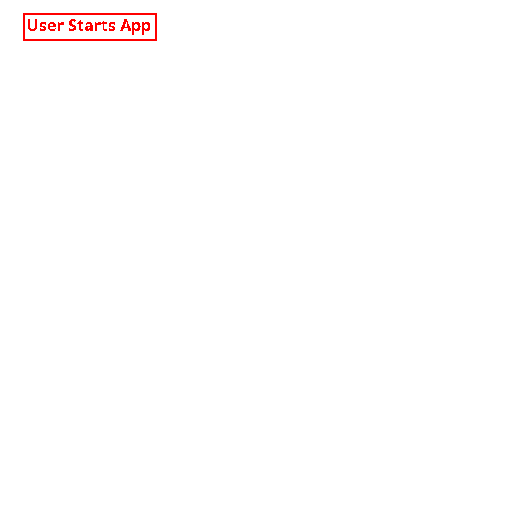

# 🔐 Mangrypt

> ⚠️ **This application is currently under active development. Features may change, and bugs may occur. Data encrypted using this version of the app might not be portable to the next version. Use with caution.**

**Mangrypt** is a user-friendly encryption application designed to protect sensitive user data. It supports encryption for text, images, audio, and video, storing data in individually encrypted `.mgvault` files for easy management.

---

## 🔽 Download & Installation

- Visit the [Releases Page](https://github.com/RedStoneMango/Mangrypt/releases) to download the latest version for your operating system.
- Extract the executable:
  - `.exe` (Windows)
  - `.app` (macOS)
  - `.sh` (Linux)
- Run it natively on your OS.

---

## 🖼️ Application UI

The following references illustrate the application UI's appearance:

| Vault File Overview                       | Accessing a Vault                                |
|-------------------------------------------|--------------------------------------------------|
|  |  |

| Folder Overview                            | Folder content                                      |
|--------------------------------------------|-----------------------------------------------------|
|  |  |

| Text-Data View                               | Obscuring Sensitive Data                        |
|----------------------------------------------|-------------------------------------------------|
|  |  |

> ⚠️ UI elements shown may change in future versions and may not exactly match these screenshots.

---

## 🔒 Encryption Architecture

Mangrypt uses a **two-layer encryption model** to ensure data integrity and privacy.

### 🗂️ Architecture Overview

### 1️⃣ Layer One – *Launch Passphrase*

The first layer secures a minimal configuration structure (vault names and other insensitive metadata), encrypted using:

- **AES-128-GCM** with a 128-bit key and 12-byte IV  
- **128-bit authentication tag**  
- **PBKDF2 with HMAC-SHA256** (65,536 iterations)  
- **16-byte salt**  
- A **user-defined passphrase**

> This passphrase is required every time Mangrypt is launched. Use a strong and unique passphrase.

### 2️⃣ Layer Two – *Access Password*

Once Layer One is decrypted, sensitive data can be unlocked by a second password. This layer uses:

- The same **AES-128-GCM** encryption configuration  
- A separate **Access Password**

On startup, **Mangrypt** also prompts for this password but does not immediately use it. Instead the key is securely stored and will be used automatically to decrypt sensitive data on demand.

> If the Mangrypt window loses focus, the app automatically obscures all content and re-prompts for the **Access Password** to protect unattended data.

### 🧠 Memory Usage

The **Java Virtual Machine** employs a **Garbage Collector (GC)** that automatically identifies and clears unused objects from memory, automatically erasing possibly sensitive data after their use.

Mangrypt follows secure memory handling practices to reduce the risk of memory leaks and unintended data persistence. Sensitive data and passwords are immediately overwritten after use, encryption is performed only on demand, and no sensitive values are stored in immutable objects.

While **JavaFX (JFX)** components internally use `String` objects, Mangrypt ensures that any sensitive input from the UI is promptly converted to `char[]` for controlled handling. These UI fields are cleared as soon as they’re no longer needed, minimizing exposure within the application's memory.

---

## ⚠️ Security Notice

While Mangrypt is designed with strong encryption practices and careful attention to security, it has **not yet undergone a formal third-party security audit**. This means that, although it is built with best practices in mind, absolute protection cannot be guaranteed at this stage.

**Help harden Mangrypt. If you're a security expert, your review or audit would be extremely valuable.**

For information on feedback or contributions, see [here](#-feedback--contributions).

---

## 🛠️ Build, Frameworks and Dependencies

Mangrypt is written using:

- **JDK:** [`OpenJDK`](https://openjdk.org/) 23
- **Build Tool:** [`Apache Maven`](https://maven.apache.org/) 3.8.5
- **UI Framework:** [`JavaFX`](https://openjfx.io) 23
- **Native Packaging:** [`javapackager`](https://github.com/javapackager/JavaPackager) 1.7.6
- **Json Handling:** [`Gson`](https://github.com/google/gson) 2.11.0
- **Utility dependencies:** [`Mango-Utils`](https://github.com/RedStoneMango/Mango-Utils) 1.1.1

---

## ✅ Benefits

- **Two-Layer Encryption:** Dual-password system ensures both configuration and session data are securely protected.
- **Multi-Media Support:** Encrypts text, images, audio, and video files.
- **Auto-Lock on Focus Loss:** Automatically obscures sensitive content when the app loses focus.
- **File Management:** Stores vaults in individually encrypted `.mgvault` files, providing easy backup and export capabilities.
- **Cross-Platform:** Works on Windows, macOS, and Linux.
- **Open Source:** Transparent development with opportunities for community contributions.

---

## 💻 Requirements

To run or build Mangrypt, ensure your environment meets the following minimum requirements:

| Requirement      | Needed For | Specification                   |
|------------------|------------|---------------------------------|
| Java JDK         | Build only | Version 23+                     |
| Apache Maven     | Build only | Version 3.8.5+                  |
| JavaFX SDK       | Build only | Version 23+ (matching your JDK) |
| Operating System | All        | Windows, macOS, or Linux        |
| Memory           | All        | 4 GB minimum (8 GB recommended) |

> 🧠 Info: Requirements marked as "Build only" are not needed if using a pre-built executable.

---

## 📎 License

This project is licensed under .

You may use the project as long as you follow the terms of that very license.

---

## 💬 Feedback & Contributions

Feedback, suggestions, and contributions are most welcome. To participate, [open an issue](https://github.com/RedStoneMango/Mangrypt/issues) or submit a pull request.
