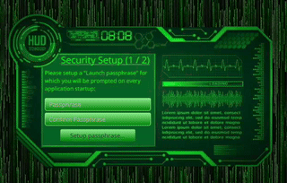

# 🔐 Mangrypt

> ⚠️ **This application is currently under active development. Features may change, and bugs may occur. Use with caution.**

**Mangrypt** is an advanced encryption application designed to protect sensitive user data. It supports encryption for text, images, audio, and video, and includes a secure, fully enclosed web browser for private browsing.

---

## 🔽 Download & Installation

You can use Mangrypt by downloading a pre-built executable or building it manually.

### 📦 Executable (Recommended)

- Visit the [Releases Page](https://github.com/RedStoneMango/Mangrypt/releases) to download the latest version for your OS.
- Extract and run the executable (`.exe`, `.app`, or shell script).

### 🧱 Build from Source

To build Mangrypt yourself and generate a native executable, see:  
👉 [**BUILDING.md →**](./BUILDING.md)

---

## 🖼️ Images and Recordings

| Setting Up The "Launch passphrase"    |
|---------------------------------------|
|  |

> ⚠️ Note: UI elements shown may change in future versions and may not exactly match these screenshots.

---

## 🔒 Encryption Architecture

Mangrypt uses a **two-layer encryption model** to ensure data integrity and privacy.

### 1️⃣ Layer One – *Launch Passphrase*

The first layer secures a minimal configuration structure (JSON-like format), encrypted using:

- **AES-128-GCM** with a 128-bit key and 12-byte IV  
- **128-bit authentication tag**  
- **PBKDF2 with HMAC-SHA256** (65,536 iterations)  
- **16-byte salt**  
- A **user-defined passphrase**

> This passphrase is required every time Mangrypt is launched. Use a strong and unique passphrase.

---

### 2️⃣ Layer Two – *Session Password*

Once Layer One is decrypted, your sensitive data is unlocked by a second password. This layer uses:

- The same **AES-128-GCM** encryption configuration  
- A separate **Session Password**

> If the Mangrypt window loses focus, the app automatically obscures all content and re-prompts for the **Session Password** to protect unattended data.

---

## 🛠️ Build and Framework

Mangrypt is built using:

- **Language:** Java 21+  
- **Build Tool:** Maven 3.8+  
- **UI Framework:** JavaFX 21+  
- **Native Packaging:** [`javapackager` Maven Plugin](https://github.com/javapackager/JavaPackager)

---

## ✅ Benefits

- **Two-Layer Encryption:** Dual-password system ensures both configuration and session data are securely protected.
- **Multi-Media Support:** Encrypts text, images, audio, and video files.
- **Privacy-Focused Browser:** Built-in, isolated browser for secure, private browsing sessions.
- **Auto-Lock on Focus Loss:** Automatically obscures sensitive content when the app loses focus.
- **Cross-Platform:** Works on Windows, macOS, and Linux.
- **Open Source:** Transparent development with opportunities for community contributions.

---

## 💻 Requirements

To run or build Mangrypt, ensure your environment meets the following minimum requirements:

- **Java Development Kit:\*** Java 21 or higher
- **Build Tool:\*** Apache Maven 3.8 or higher  
- **JavaFX SDK:\*** Version 21 or higher (matching your Java version)  
- **Operating System:** Windows, macOS, or Linux (GUI environment required)  
- **Memory:** 4 GB RAM minimum (8 GB recommended for large media files)

> 🧠 Info: Requirements marked with "\*" are needed for source building only.

---

## 💬 Feedback & Contributions

We welcome feedback, suggestions, and contributions. To participate, [open an issue](https://github.com/RedStoneMango/Mangrypt/issues) or submit a pull request.

---
